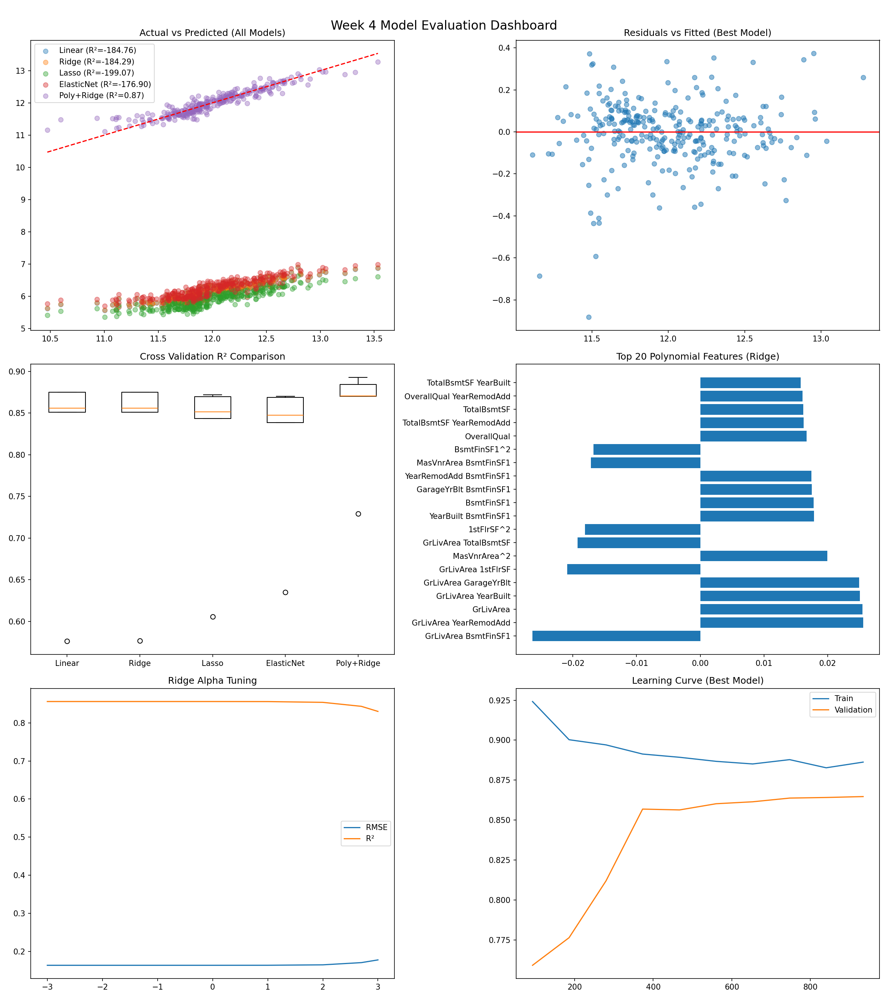

# AIML-Internship-Week4-Ghina-Durrani– Regression Project

## 📌 Project Overview
This project is part of the AI/ML Internship Week 4. It focuses on building and evaluating multiple regression models to predict house prices using the Kaggle House Prices dataset.

---

## 📊 Dataset
- Dataset: House Prices (Kaggle)
- Target Variable: SalePrice (log-transformed for modeling)
- Features: 20 selected engineered features including quality, area, and structural attributes

---

## 🤖 Models Trained
The following 5 regression models were trained and evaluated:

- Linear Regression  
- Ridge Regression  
- Lasso Regression  
- ElasticNet Regression  
- Polynomial Regression + Ridge

---

## 🏆 Best Model
- **Model:** Polynomial Regression + Ridge (degree=2, alpha=100)  
- **Test R²:** 0.8703  
- **RMSE (log scale):** 0.1556  
- **RMSE (dollars):** ~0.1683 (after inverse transformation)

This model performed best due to its ability to capture non-linear relationships while controlling overfitting using Ridge regularization.

---

## 🛠️ Tools & Libraries Used
- Python  
- Pandas, NumPy  
- Scikit-learn  
- Matplotlib, Seaborn  
- Jupyter Notebook  
- Joblib (model saving)

---

## 📈 Dashboard Preview

---

## 🚀 Key Learnings
- End-to-end ML pipeline development
- Feature engineering and scaling
- Model comparison and evaluation
- Regularization techniques (Ridge, Lasso, ElasticNet)
- Polynomial feature expansion
- Cross-validation and hyperparameter tuning
